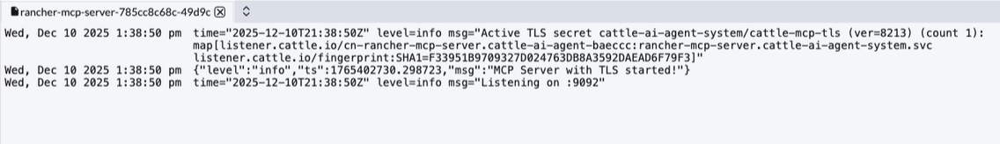
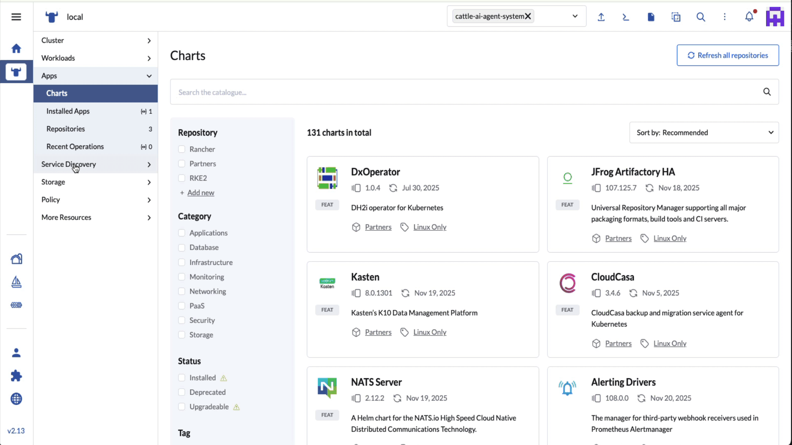
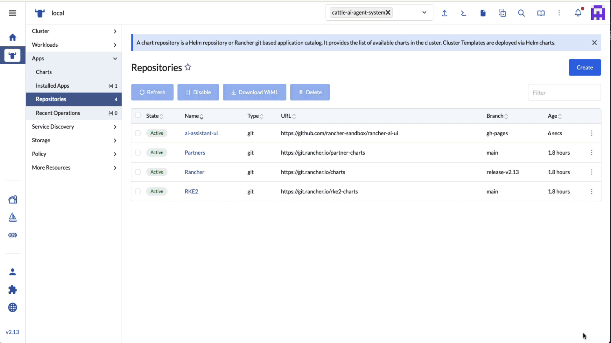

# Install and Setup Rancher AI

Rancher AI should be installed in the `local` cluster. This allows Rancher AI to see all downstream clusters.

SUSE Rancher AI requires a cluster with Rancher 2.13.x installed.
If your cluster is pre-2.13, you need to complete additional steps.

Before the install, you need to create a values.yaml file with your deployment-specific information.

For details on how to create your values.yaml, see [sample-values/README.md](sample-values/README.md)

## Install Rancher-AI Agent

### Setup Helm Repository
```bash
helm repo add rancher-ai https://rancher.github.io/rancher-ai-agent
helm repo update
```

### Install Rancher AI Agent
```bash
helm install rancher-ai-agent rancher-ai/agent \
  --namespace cattle-ai-agent-system \
  --create-namespace \
  --devel \
  -f values.yaml
```

## View Deployments

Check the status of the Rancher AI Agent. There are 2 pods that are deployed to the `cattle-ai-agent-system` namespace.

### View the `rancher-mcp-server`



### View the `rancher-ai-agent` log

If you enabled RAG it takes ~3 mins to build the RAG DB, watch the logs until you see `Uvicorn running on http://0.0.0.0:8000`


# Install UI Extension

## Add the Rancher UI Repo

1) On Rancher Manager, click on Extension in the menu bar.
2) Use the three-dot menu in the upper right and select 'Manage Repositories'
3) Click 'Create' to add the repository
4) Configure the repository:
    
    1) name: ai-assistant-ui
    2) target: Git repository containing Helm chart or cluster template definitions
    3) index URL: https://github.com/rancher/rancher-ai-ui
    4) Git Branch: gh-pages



## Add the Rancher UI Plugin

1) Select the Globe Icon on the lower left to add the UI Plugin

2) Select the `AI Assistant`



# Setup Backend

## Ollama

For setting up a self-hosted Ollama backend, see [config-ollama/README.md](config-ollama/README.md)

## OpenAI

To use OpenAI as your backend, you'll need:
- An OpenAI API key
- To specify the OpenAI URL in your values.yaml

See [sample-values/README.md](sample-values/README.md) for configuration details.

## Google Gemini

To use Google Gemini as your backend, you'll need:
- A Gemini API key linked to your Google account

See [sample-values/README.md](sample-values/README.md) for configuration details.

# Demoing Rancher AI

For demo scenarios and broken deployments to test Rancher AI's capabilities, see [demo/Demos.md](demo/Demos.md)

# Links for Rancher AI

## Rancher-AI Quickstart

https://drive.google.com/file/d/1dGjTnJsk4RWv_aqAMUhHiH3BEocmG-8F/view


## Rancher Ai Agent on GitHub

[Rancher AI Agent Repository](https://github.com/rancher-sandbox/rancher-ai-agent)

## Rancher MCP

[Rancher AI MCP Repository](https://github.com/rancher-sandbox/rancher-ai-mcp)

## rancher-ai-ui on GitHub

[Rancher AI UI Repository](https://github.com/rancher/rancher-ai-ui)

## SUSE® Rancher Prime: AI - Assistant Early Adopters Program

https://drive.google.com/file/d/1lXopcOwL5hWHJSkQkUKoDxmnqwEuCSfF/

## SUSE Rancher Prime: AI Assistant Liz Deck

https://docs.google.com/presentation/d/19DlHhFwW0RBf1BFcYRZW1BKGfZKknAGpluINRMGXe30/edit?slide=id.g34098e29a71_0_6#slide=id.g34098e29a71_0_6

# Links for Setting up NVIDIA drivers

## Installing NVIDIA drivers

https://github.com/SUSE-Technical-Marketing/suse-ai-demo/blob/main/install/Install-NVIDIA-drivers.md

## SUSE AI on SLES 16

https://lajoie.de/blog2/index.html

## Setting up Timeslicing for a NVIDIA GPU

https://github.com/SUSE-Technical-Marketing/suse-ai-demo/blob/main/install/Enable-vGPU-Timeslicing.md
